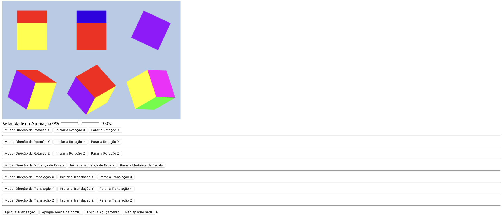
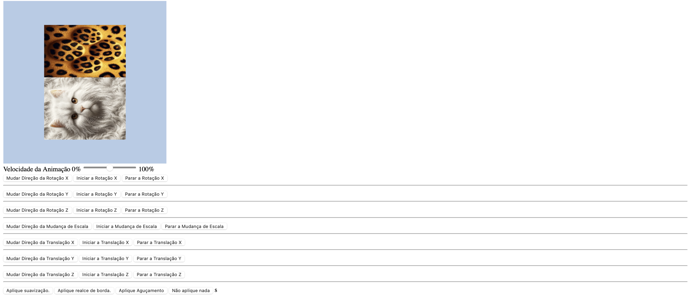

README - Projetos de Computação Gráfica

Descrição do Projeto

Este repositório contém projetos desenvolvidos na disciplina de Computação Gráfica, utilizando WebGL para renderização de objetos 3D e aplicação de transformações e projeções. O objetivo principal é criar uma cena composta por diferentes vistas de um cubo, permitindo a interação e visualização de diversas transformações aplicadas a ele.

Estrutura do Projeto

Arquivos Principais
index.html: Contém a estrutura básica da página e elementos de interface para interação com a cena.
main.js: Contém o código JavaScript responsável pela lógica do projeto, incluindo a inicialização do WebGL, shaders, buffers, e lógica de transformação.
utils.js: Biblioteca utilitária que auxilia na inicialização de shaders, buffers e outras operações comuns em WebGL.
textures/: Diretório que contém as imagens de textura utilizadas nos objetos.

